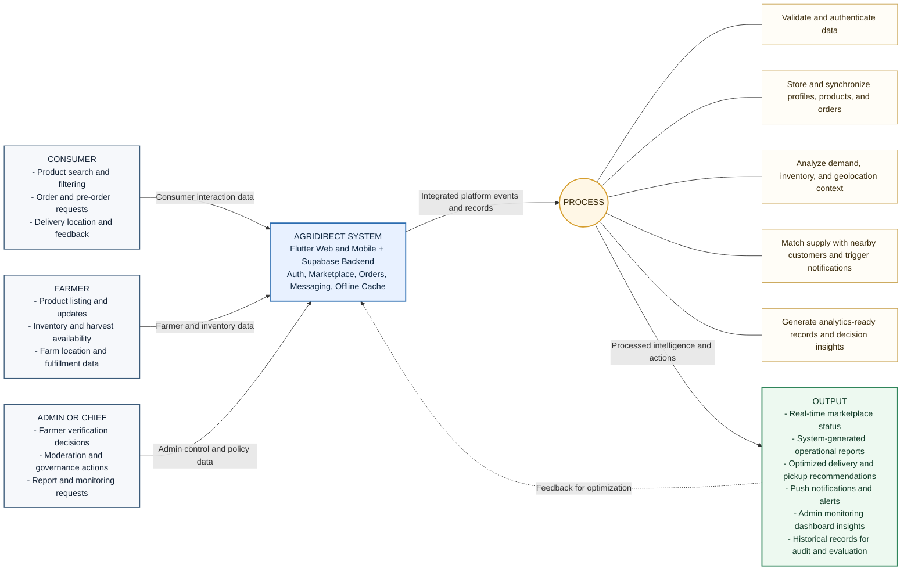

# Figure 2.6.1 Conceptual Framework (AgrIDirect)

This framework mirrors the same structure as your sample image:
Inputs from major user groups flow into the AgrIDirect system, the system executes core processing, then generates operational and decision-support outputs.

## Mermaid Diagram

