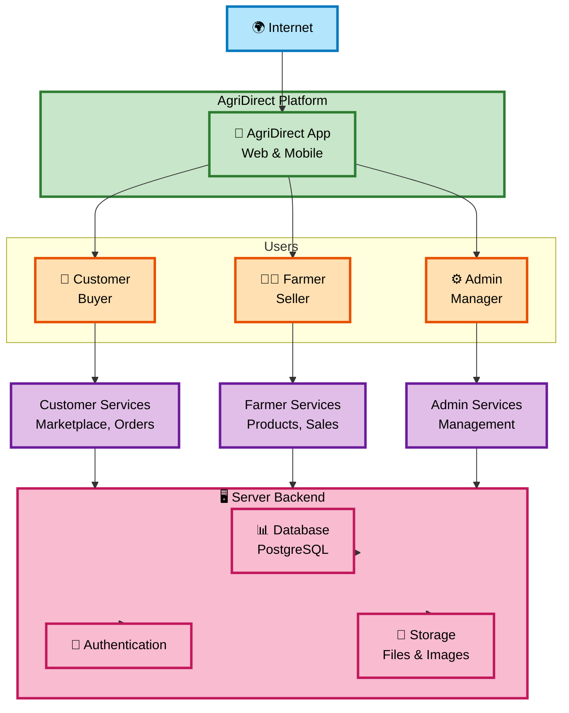

# AgriDirect System Architecture

## System Mapping

## Overview

| Component | Description |
|-----------|------------|
| **Internet** | Global connectivity |
| **AgriDirect** | Web & Mobile application |
| **Customer** | Buyers - Browse & purchase products |
| **Farmer** | Sellers - List & manage products |
| **Admin** | Managers - Oversee platform |
| **Server** | Backend infrastructure (Database, Auth, Storage) |

## Technology Stack

- **Frontend**: Flutter (Web & Mobile)
- **Backend**: Supabase (PostgreSQL)
- **Auth**: Email/OTP + Google OAuth
- **Storage**: File buckets for images

---

*Last Updated: 2026-03-21*
